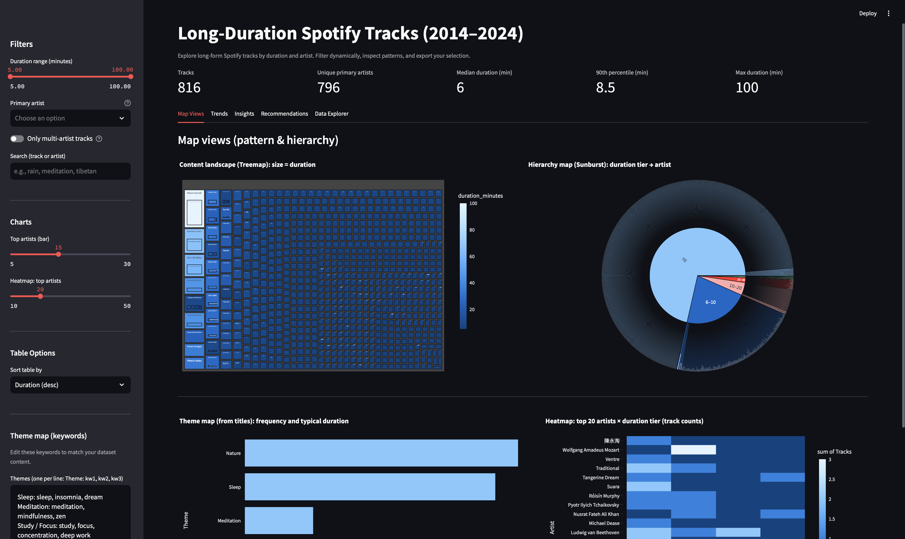
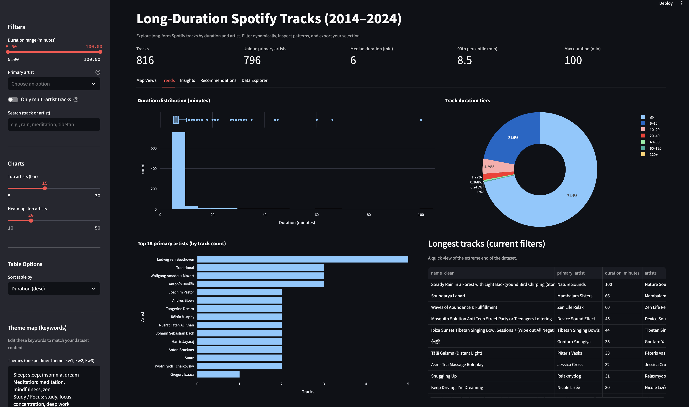
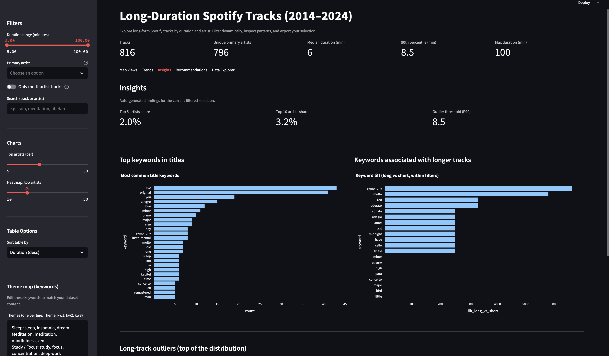
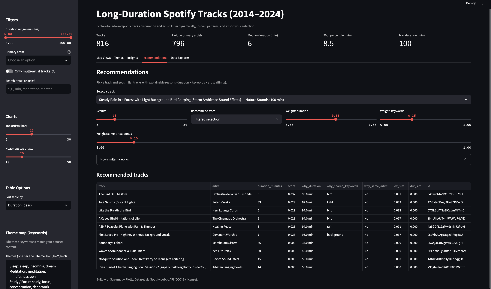

# Long-Duration Spotify Tracks (2014–2024) - Streamlit Dashboard

A polished, interactive Streamlit dashboard exploring **long-duration Spotify tracks** collected via Spotify’s public API.  
Includes a portfolio-style data cleaning notebook, an **Insights** tab, and **explainable Recommendations** (no black-box ML).

---

## Live Demo
- **App:** (paste link)

---

## Screenshots

### Map Views (Treemap + Sunburst + Theme Map + Heatmap)


### Trends (Histogram + Duration Tiers + Top Artists + Longest Tracks)


### Insights (Top keywords, long-track keyword lift, concentration, outliers)


### Recommendations (Similar tracks with explainable reasons)


---

## Key Features

### Interactive exploration
- Duration range slider
- Primary artist filter
- Multi-artist toggle
- Fast search across track + artist
- Download filtered dataset as CSV

### High-signal visuals (Plotly)
- **Treemap**: artist → track sized by duration (catalog landscape)
- **Sunburst**: duration tier → artist (hierarchy map)
- **Theme map**: keyword-based title tagging (sleep/meditation/nature/focus etc.)
- **Heatmap**: top artists × duration tiers (pattern map)
- **Trends**: histogram + tier donut + top artists + longest tracks

### Insights tab (portfolio-friendly)
- Top keywords in titles (cleaned tokens)
- Keyword “lift” associated with longer tracks (within current filters)
- Artist concentration metrics (share of tracks by top artists)
- Outlier view (top of the duration distribution)

### Recommendations (explainable similarity)
Pick a track → see similar tracks scored by:
- **Duration similarity** (closer duration → higher score)
- **Keyword overlap** (Jaccard similarity of title tokens)
- **Same-artist bonus** (optional small boost)

Each recommendation includes “why”: duration difference, shared keywords, and artist match.

---

## Project Structure

```text
.
├── app.py
├── data_clean.csv
├── requirements.txt
├── notebooks/
│   └── 01_data_cleaning.ipynb
├── screenshots/
│   ├── map_views.png
│   ├── trends.png
│   ├── insights.png
│   └── recommendations.png
├── DASHBOARD_GUIDE.md
├── README.md
└── LICENSE
```

---

## Run Locally

```bash
pip install -r requirements.txt
streamlit run app.py
```

---

## Deploy to Streamlit Community Cloud (Free)

1. Push this project to GitHub (include `app.py`, `requirements.txt`, `data_clean.csv`)
2. Create a new Streamlit app and point it to `app.py`
3. Deploy

---

## What I Learned

- Designing dashboards that communicate a story (KPIs → patterns → drill-down)
- Converting raw fields into interpretable features (**duration tiers**, **title tokens**)
- Building **explainable** insights and recommendations without heavy ML
- Shipping a portfolio project with clean structure, reproducibility, and documentation

---

## Data & License

- Data source: Spotify public API (ethically collected)
- Dataset license: **ODC Attribution License (ODC-By)**
- This project is for educational and portfolio purposes

---

## Credits
Built with Streamlit, Plotly, Pandas, and NumPy.
